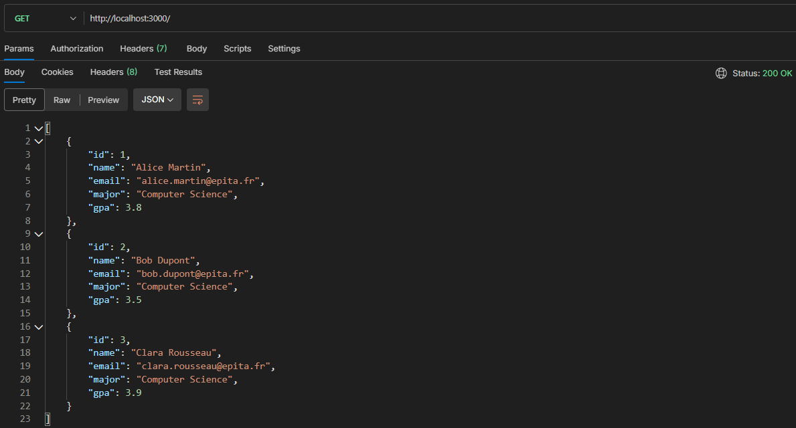

<p align="center">
  
  <h1 align="center">STudent API - Lab Report</h1>
  <p align="center">A REpresentational State Transfer Application Program Interface utilizing a JSON file as model. <b>Report examined by <a href="https://github.com/lostmart">@lostmart</a></b></p>
  

  <div align="center">
    
  
  
  </div>

  <div align="center">
    
  [Overview](../README.md)
  </div>
</p>

## Functionality Overview
<p align="center">
  

## Received Instructions
* Report documents your progress building a REST API with Node.js and Express.
* For ∀ section, answer the questions in your own words and include the required screenshots.
* Screenshots must be clear and readable. Crop them to show only the relevant part of the screen.

<br/><br/>

## Section 1 — Project Setup
### 1.1 Package.json & Nodemon
Nodemon is a development tool that automatically restarts your server when you save a file. It should be installed as a **dev dependency** — meaning it is only needed during development, not in production.

**Your task:** Explain in your own words the difference between a regular dependency and a dev dependency. Why does it matter?
>The difference between a `dependency` and a `devDependency` is that the `devDependency` object consists of dependencies the developer needs to properly conceive the intended goal, whereas the `dependency` object includes critical dependencies needed for the project to function as intended. This distinction matters for the client to avoid installing dependencies that serve no purpose for them.

<br/>

### 1.2 CommonJS vs. ES Modules
Node.js supports two module systems. You may encounter both in the wild.

|  | CommonJS (old) | ES Modules (new) |
| --- | --- | --- |
| Import | `const x = require('x')` | `import x from 'x'` |
| Export | `module.exports = x` | `export default x` |
| Enable | Default in Node.js | Add `"type": "module"` in `package.json` |

**Your task:** Which module system is your project using? How do you know?
>The project uses the ES6 module system. This can be determined by navigating to [package.json::line18](../package.json) and finding the `type` property.

<br/>

### Project File Structure [SCREENSHOT 1]
Take a screenshot of your project folder open in VS Code (the Explorer panel on the left). Your structure should show at minimum:
```
project/
├── index.js
├── package.json
├── package-lock.json
├── node_modules/
└── students.json
```

><p align="center"></p>

## Section 2 — Your First Endpoints
### 2.1 How Express Handles a Request
When a client makes a request to your server, Express matches the URL and HTTP method to a route, then runs a callback function. That callback receives two objects: `req` (the incoming request) and `res` (the response you send back).

**Your task:** In your own words, what is a route? What is an endpoint?
>A route is a URL path where resources live. An endpoint is the specific HTTP method that happens at a route; essentially, it is the combination of **Route + HTTP Method**.

<br/>

### 2.2 Sending Responses & Status Codes
Every HTTP response includes a **status code** that tells the client whether the request succeeded or failed.

| Code | Meaning | When to use |
| --- | --- | --- |
| `200` | OK | Successful GET or PUT |
| `201` | Created | Successful POST (something was created) |
| `400` | Bad Request | The client sent invalid data |
| `404` | Not Found | The resource doesn't exist |
| `500` | Internal Server Error | Something broke on the server |

**Your task:** What status code does Express send by default if you don't set one? Is that always appropriate?
>The status code 200 OK is sent by default if status code is not set. This is inappropriate because the status code is how the backend communicates the result of a `req` at the network level. If this is done, you, in the client-side, will have to manually parse your JSON body on every single request just to figure out if an error occurred.

### Screenshot 2 — Postman: GET Request
Using Postman, make a GET request to your root endpoint (`/`). Take a screenshot showing:

- The request URL and method
- The response body (your JSON)
- The **status code** returned (visible in Postman's response panel)

><p align="center"></p>
