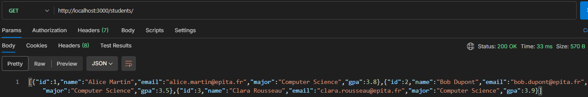

<p align="center">
  
  <h1 align="center">STudent API - Lab Report</h1>
  <p align="center">A REpresentational State Transfer Application Program Interface utilizing a JSON file as model. <b>Report examined by <a href="https://github.com/lostmart">@lostmart</a></b></p>
  

  <div align="center">
    
  
  
  </div>

  <div align="center">
    
  [Overview](../README.md)
  </div>
</p>

## Functionality Overview
<p align="center">
  

## Received Instructions
* Report documents your progress building a REST API with Node.js and Express.
* For ∀ section, answer the questions in your own words and include the required screenshots.
* Screenshots must be clear and readable. Crop them to show only the relevant part of the screen.

<br/><br/>

## Section 1 — Project Setup
### 1.1 Package.json & Nodemon
Nodemon is a development tool that automatically restarts your server when you save a file. It should be installed as a **dev dependency** — meaning it is only needed during development, not in production.

**Your task:** Explain in your own words the difference between a regular dependency and a dev dependency. Why does it matter?
>The difference between a `dependency` and a `devDependency` is that the `devDependency` object consists of dependencies the developer needs to properly conceive the intended goal, whereas the `dependency` object includes critical dependencies needed for the project to function as intended. This distinction matters for the client to avoid installing dependencies that serve no purpose for them.

<br/>

### 1.2 CommonJS vs. ES Modules
Node.js supports two module systems. You may encounter both in the wild.

|  | CommonJS (old) | ES Modules (new) |
| --- | --- | --- |
| Import | `const x = require('x')` | `import x from 'x'` |
| Export | `module.exports = x` | `export default x` |
| Enable | Default in Node.js | Add `"type": "module"` in `package.json` |

**Your task:** Which module system is your project using? How do you know?
>The project uses the ES6 module system. This can be determined by navigating to [package.json::line18](../package.json) and finding the `type` property.

<br/>

### Project File Structure [SCREENSHOT 1]
Take a screenshot of your project folder open in VS Code (the Explorer panel on the left). Your structure should show at minimum:
```
project/
├── index.js
├── package.json
├── package-lock.json
├── node_modules/
└── students.json
```

><p align="center"></p>

## 📸 Screenshot 3 — Project File Structure
### 2.1 How Express Handles a Request
When a client makes a request to your server, Express matches the URL and HTTP method to a route, then runs a callback function. That callback receives two objects: `req` (the incoming request) and `res` (the response you send back).

**Your task:** In your own words, what is a route? What is an endpoint?
>A route is a URL path where resources live. An endpoint is the specific HTTP method that happens at a route; essentially, it is the combination of **Route + HTTP Method**.

<br/>

### 2.2 Sending Responses & Status Codes
Every HTTP response includes a **status code** that tells the client whether the request succeeded or failed.

| Code | Meaning | When to use |
| --- | --- | --- |
| `200` | OK | Successful GET or PUT |
| `201` | Created | Successful POST (something was created) |
| `400` | Bad Request | The client sent invalid data |
| `404` | Not Found | The resource doesn't exist |
| `500` | Internal Server Error | Something broke on the server |

**Your task:** What status code does Express send by default if you don't set one? Is that always appropriate?
>The status code 200 OK is sent by default if status code is not set. This is inappropriate because the status code is how the backend communicates the result of a `req` at the network level. If this is done, you, in the client-side, will have to manually parse your JSON body on every single request just to figure out if an error occurred.

### 📸 Screenshot 2 — Postman: GET Request
Using Postman, make a GET request to your root endpoint (`/`). Take a screenshot showing:

- The request URL and method
- The response body (your JSON)
- The **status code** returned (visible in Postman's response panel)

><p align="center"></p>

## Section 3 — Serving Student Data
### 3.1 Loading Data from a JSON File
Before connecting a real database, it is common to use a local JSON file as a data source. Node.js can read and import JSON files directly.

**Your task:** How did you load the `students.json` file in your project? Did you use `require` or `import`? Paste the line of code here.
>I loaded the `students.json` file via an asynchronous function called loadData(). I neither used CommonJS's `require` nor ES6's `import`:

file> [studentRepository](../repositories/studentRepository.js)

```
// Setup the absolute path to the JSON file
const __dirname = dirname(fileURLToPath(import.meta.url));
const filePath = join(__dirname, '../students.json'); 

// --- HELPER FUNCTIONS ---
export async function loadData() {
  const data = await readFile(filePath, 'utf-8');
  return JSON.parse(data);
}
```

### 3.2 The GET /students Endpoint
Your server exposes a `/students` endpoint that returns the full list of students as a JSON response.

**Your task:** What does `res.json()` do differently from `res.send()`? Why do we prefer it for API responses?
>`res.json()` is strictly for sending JSON data (via `JSON.stringify(), and Content-Type as application/json`). `res.send()` is all-purpose sender. It looks at inputted data, scans what type of data it is, and automatically sets `Content-Type`. The reason it is preferred is because APIs are usually dealt with using JSON objects: six months from now, if I return to my code and I notice res.json(), I will probably realize it is dealing with an API rather than rendering an HTML page. It also eliminates any possible edge case associated with fetching data from the backend to the frontend.

---

### 📸 Screenshot 3 — Postman: Student Data Response
Make a GET request to `/students` in Postman. Take a screenshot showing:

- The full URL (`http://localhost:3000/students`)
- The JSON array returned in the response body
- The status code

><p align="center"></p>

---

## Section 4 — CORS & Body Parser
### 4.1 What is CORS?
**CORS** (Cross-Origin Resource Sharing) is a browser security mechanism. When a web page running on one origin (e.g. `http://localhost:5500`) tries to fetch data from a different origin (e.g. `http://localhost:3000`), the browser blocks the request by default unless the server explicitly allows it.
This is a **browser restriction** — it does not affect Postman or server-to-server communication.

**Your task:** Before enabling CORS, open your `index.html` frontend in the browser and observe the error in the console. What does the error say?
> *Your answer here...*

---

### 📸 Screenshot 4 — Network Tab: CORS Error (Before Fix)
Open your browser DevTools (`F12`), go to the **Network** tab, and reload your frontend page before enabling CORS on your server.
Take a screenshot showing:

- The failed request in the network list (usually shown in red)
- The error details (you can click the request to expand it)
- The Console tab error message if visible

> **[Insert screenshot here]**

---

### 4.2 Enabling CORS
After installing and enabling the `cors` package, the browser will accept responses from your API.
**Your task:** Where in your `index.js` did you add `app.use(cors())`? Why does the order of middleware matter in Express?

> *Your answer here...*

### 4.3 Express Body Parser
To read data sent in the **body** of a POST or PUT request, Express needs a body parser. Since Express 4.16+, this is built in:

```jsx
app.use(express.json())
```

**Your task:** What happens if you forget to add `express.json()` and a client sends JSON in the request body? What would `req.body` contain?
> *Your answer here...*

---

### 📸 Screenshot 5 — Network Tab: Successful Response (After Fix)
With CORS enabled, reload your frontend. Open the Network tab and click on the request to your API.
Take a screenshot showing:

- The request listed in the Network tab (status `200`)
- The **Response** or **Preview** sub-tab showing the returned data
- The **Headers** sub-tab showing `Access-Control-Allow-Origin` in the response headers

> **[Insert screenshot here]**

## Section 5 — CRUD & HTTP Methods

### 5.1 The Four Operations

Every data-driven application is built around four fundamental operations: **Create, Read, Update, Delete** — known as **CRUD**. Each maps to an HTTP method.

| CRUD | HTTP Method | Typical URL | What it does |
| --- | --- | --- | --- |
| Read | `GET` | `/students` | Retrieve a list or a single item |
| Create | `POST` | `/students` | Add a new item |
| Update | `PUT` | `/students/:id` | Replace an existing item |
| Delete | `DELETE` | `/students/:id` | Remove an item |

### 5.2 Your Route Signatures

Below are the route signatures your API should define. You do not need to implement full logic yet — focus on the structure.

```jsx
// GET all students
app.get('api/students', (req, res) => { /* ... */ })

// GET a single student by ID
app.get('api/students/:id', (req, res) => { /* ... */ })

// POST — create a new student
app.post('api/students', (req, res) => { /* ... */ })

// PUT — update a student by ID
app.put('api/students/:id', (req, res) => { /* ... */ })

// DELETE — remove a student by ID
app.delete('api/students/:id', (req, res) => { /* ... */ })
```

**Your task:** What is `:id` in the URL? How do you access it in your handler function?

> *Your answer here...*
> 

**Your task:** For a POST request that successfully creates a new student, which status code should you return and why?

> *Your answer here...*
> 

---

## Section 6 — Refactoring: Routes → Controllers → Services

### 6.1 Why We Split Files

As an application grows, keeping all logic in a single `index.js` becomes hard to read and maintain. We separate responsibilities into layers:

| Layer | File | Responsibility |
| --- | --- | --- |
| **Entry point** | `index.js` | Start the server, register middleware |
| **Routes** | `routes/students.js` | Define URL patterns and HTTP methods |
| **Controllers** | `controllers/studentsController.js` | Handle the request, call service, send response |
| **Services** | `services/studentsService.js` | Business logic, data access |

This separation means each file has **one job**. A route file does not know how data is fetched. A service file does not know anything about HTTP.
**Your task:** In your own words, what is the difference between a controller and a service? Give a concrete example from your project.

> *Your answer here...*


### 6.2 Target Folder Structure
After refactoring, your project should look like this:

```
project/
├── index.js
├── package.json
├── students.json
├── routes/
│   └── students.js
├── controllers/
│   └── studentsController.js
└── services/
    └── studentsService.js
```

---

### 📸 Screenshot 6 — Refactored Folder Architecture
Take a screenshot of your project in VS Code after refactoring. The Explorer panel should show the full folder tree including `routes/`, `controllers/`, and `services/`.

> **[Insert screenshot here]**

---

### 📸 Screenshot 7 — Network Tab: API Still Works After Refactor
After refactoring, your API should behave exactly as before. Use the Network tab to confirm a GET request to `/students` still returns the correct data.
This screenshot proves that refactoring did not break anything.
> **[Insert screenshot here]**

## Section 7 — Debugging with the Network Tab

The browser's Network tab is one of the most useful debugging tools available to you. It shows every request your page makes and every response it receives.

### 7.1 What to Look For

| What | Where to find it | Why it matters |
| --- | --- | --- |
| Request method & URL | Request Headers | Confirms the right endpoint was called |
| Status code | Status column / Response Headers | Tells you if the request succeeded |
| Response body | Response / Preview tab | Shows what data was actually returned |
| CORS headers | Response Headers | `Access-Control-Allow-Origin` must be present |
| Request body | Payload tab | For POST/PUT — confirms data was sent correctly |

**Your task:** Describe a bug you encountered during this lab. How did the Network tab (or Postman) help you identify and fix it?

> *Your answer here...*
> 

---

## Section 8 — Deliverables Checklist

Before submitting, verify everything below is complete.

### Code

- [ ]  Project runs with `npm run dev` without errors
- [ ]  `nodemon` is installed as a dev dependency
- [ ]  Module system is consistent throughout the project (CommonJS **or** ES Modules, not mixed)
- [ ]  `cors` is installed and enabled
- [ ]  `express.json()` middleware is registered
- [ ]  `students.json` data is served via `GET /students`
- [ ]  All five CRUD route signatures are defined
- [ ]  Code is refactored into `routes/`, `controllers/`, and `services/` folders
- [ ]  Project is pushed to GitHub with a descriptive README

### 

### Report

- [ ]  All reflection questions are answered in your own words
- [ ]  Screenshot 1 — Project file structure
- [ ]  Screenshot 2 — Postman: GET request to `/`
- [ ]  Screenshot 3 — Postman: GET `/students` response
- [ ]  Screenshot 4 — Network tab: CORS error before fix
- [ ]  Screenshot 5 — Network tab: successful response after fix
- [ ]  Screenshot 6 — Refactored folder architecture
- [ ]  Screenshot 7 — Network tab: API works after refactor

---

## Section 9 — Evaluation Criteria

| Criterion | ✅ Met | ⚠️ Partial | ❌ Not met |
| --- | --- | --- | --- |
| Server runs without errors |  |  |  |
| Nodemon configured as dev dependency |  |  |  |
| Module system used consistently |  |  |  |
| Students data served correctly via GET |  |  |  |
| CORS enabled and working |  |  |  |
| Body parser configured |  |  |  |
| All CRUD route signatures present |  |  |  |
| Code correctly refactored into layers |  |  |  |
| Reflection answers are thoughtful and in own words |  |  |  |
| All required screenshots included and readable |  |  |  |
| GitHub repository is accessible and up to date |  |  |  |

---

*Next up: connecting a real database. The service layer you built today is exactly where that logic will live.*
